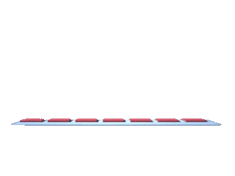

<h1 align="center">Hi, I'm Irfana Fasila  </h1>

##  About Me
 &nbsp;&nbsp;
 &nbsp;&nbsp;
- 💓 I am passionate about data analysis and development, driven by the desire to uncover insights and create impactful solutions through data-driven approaches.
- 👀 I’m looking to collaborate on Open Source Projects 
- 📩 <a href="mailto:irfanafasilak140@gmail.com">How to reach me</a> 
  

##  Socials
 

 

  

##   Languages and Tools
 

 
  
  
  
  
  
   
  
   
   
   
  
   
   
   
  

  

##  GitHub Stats:
 

 
 
 

  

##  GitHub Trophies
 

 

---
 

###  Random Dev Quote

>

 

---

 

## Loved my work? 
 

&nbsp;[Give a star to this project](https://github.com/Irfana-Fasila/Irfana-Fasila)  
&nbsp;[Follow me on GitHub](https://github.com/Irfana-Fasila) 
 [Buy me a coffee](https://www.buymeacoffee.com/irfana_fasila) (Tired of drinking Tea)

   

### Thanks for visiting! &nbsp;

   

---

